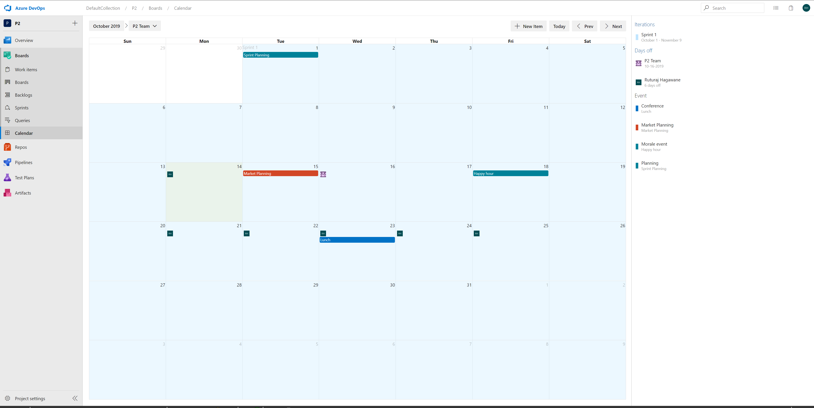

# Team Calendar Extension for Azure DevOps Server and Team Foundation Server

Team Calendar helps busy teams stay on track and informed about important deadlines, sprint schedules, and upcoming milestones. It is the one place to see and manage the date important to your teams, including sprint schedule, days off (for individuals or the team), and custom events.

> **This version supports the versions of Azure DevOps Server/Team Foundation Server up to 2019. For more current versions, and Azure DevOps Services, the [Azure DevOps Open in Excel extension](https://marketplace.visualstudio.com/items?itemName=blueprint.vsts-open-work-items-in-excel) should be used.**



See [overview](overview.md) to learn more about the features of the extension.

## About extensions

Extensions enable you to create first-class integration experiences within Visual Studio Team Services, just the way you have always wanted. An extension can be a simple context menu or toolbar action or can be a complex and powerful custom UI experience that light up within the account, collection, or project hubs.

To learn more about Extensions, see the [overview of extensions](https://www.visualstudio.com/docs/integrate/extensions/overview).

## Install

To try out the extension in your Azure DevOps account, visit the [Team Calendar extension](https://marketplace.visualstudio.com/items?itemName=ms-devlabs.team-calendar-2019) page on the Visual Studio Marketplace.

## Develop

Team Calendar is written in [TypeScript](https://www.typescriptlang.org/). To build and package the extension:

### Get the pre-reqs

1. Get [Node.js](https://nodejs.org/)
2. Install TypeScript: `npm install -g typescript`
3. Install the TFX CLI (needed to package the extension): `npm install -g tfx-cli`
4. Install required modules: `npm install` (from the root of t

### Compile the code

To compile and package the extension run:

```
npm run build
```

This will compile the TypeScript code in the project and create a .vsix file.

### Package the extension

To install your own version of the Team Calendar extension into your VSTS account, you need to create a publisher on the Visual Studio Marketplace. There is no cost for creating or having a publisher. [Learn how to create a publisher](https://www.visualstudio.com/docs/integrate/extensions/publish/overview).

1. Update your version of the extension manifest (`vss-extension.json`) file:
    1. Set the `publisher` property to your Visual Studio Marketplace publisher ID
    2. Set the `public` property to `false`
2. Package the extension (`npm run build`) to produce a .vsix file. Note: you should see your publisher ID in the name of this file.
3. Go to the [manage](https://marketplace.visualstudio.com/manage) page of the Marketplace and click **Upload** to publish your version of the extension (don't worry, only you will be able to see it)
4. After uploading, select the extension, click **Share** ,and enter the name of the VSTS account you want to be able to install the extension into
5. Click the extension's title to open its details page
6. Click the install button, choose your account from the drop-down, and install the extension

## Code of Conduct

This project has adopted the [Microsoft Open Source Code of Conduct](https://opensource.microsoft.com/codeofconduct/). For more information see the [Code of Conduct FAQ](https://opensource.microsoft.com/codeofconduct/faq/) or contact [opencode@microsoft.com](mailto:opencode@microsoft.com) with any additional questions or comments.

> Microsoft DevLabs is an outlet for experiments from Microsoft, experiments that represent some of the latest ideas around developer tools. Solutions in this category are designed for broad usage and you are encouraged to use and provide feedback on them; however, these extensions are not supported nor are any commitments made as to their longevity.