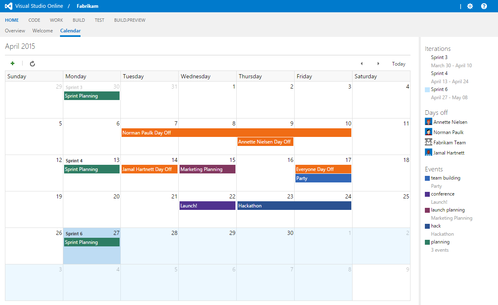

# Team Calendar Extension 

Team Calendar is an extension for Visual Studio Online that demonstrates one type of experience **you** can now develop and install into your Visual Studio Online account. Eventually you will be able to share your extensions with other users.
To learn more about Extensions, see the [overview of extensions](https://www.visualstudio.com/en-us/integrate/extensions/overview).

**Note:** Extensions is currently in private preview. To get early access, join the free [Visual Studio Partner Program](http://www.vsipprogram.com/join).

## Overview

Extensions enable you to create first-class integration experiences within Visual Studio Online, just the way you have always wanted. An extension can be a simple context menu or toolbar action or can be a complex and powerful custom UI experience that light up within the account, collection, or project hubs. 

The Team Calendar extension provides Visual Studio Online teams an integrated calendar view in web access:



### What the calendar shows

* Any iterations in the current month (the current iteration is highlighted in a light blue) – all iterations are shown on the right
* Any days off (individual users or entire team)
  * Days off (for a user or team) can be added by left-clicking on a day
* Any events added by team members
  * Events (single or multi-day) can be added by left-clicking on a day
  * Events are categorized and shown on the left

## How to try the calendar

1. Browse the code to understand how an extension is developed.
 * To learn more extensions, see an [overview of extensions](https://www.visualstudio.com/en-us/integrate/extensions/overview)
2. Modify the "try it" extension manifest 
  1. Download `extension-tryit.json` (in the Calendar folder) and save it locally
  2. Update the namespace field to something globally unique, for example: ```mycompany.team-calendar```
  3. Note the baseUri field is set to `https://vsoalmcalendar-demo.azurewebsites.net`
3. Install the extension to your account
  1. Navigate to https://youraccount.visualstudio.com/_admin/_ext (replace `youraccount` with your real Visual Studio Online account name)
  2. Click **Install** and browse to your manifest file (extension-tryit.json)
  3. Click **OK**

## How to add new event sources

The Team Calendar extension is designed to be extended by other extensions. Other extensions can contribute new "event sources", which will be pulled from when the Team Calendar is rendered. Once you develop your extension, install it in the account that you installed the Team Calendar extension into.

See the [public-events sample](https://github.com/Microsoft/vso-extension-samples/tree/master/public-events) for an example of an extension that contributes to the Team Calendar.
