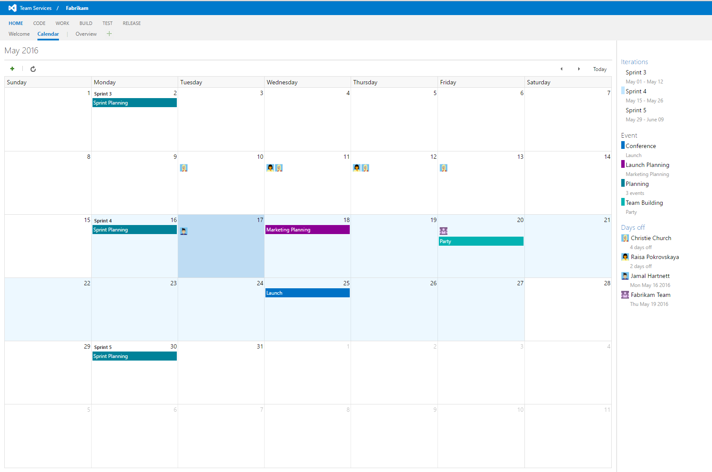

# Team Calendar Extension for Visual Studio Team Services

Team Calendar helps busy teams stay on track and informed about important deadlines, sprint schedules, and upcoming milestones. Team Calendar is the one place to see and manage the date important to your teams, including sprint schedule, days off (for individuals or the team), and custom events.

The Team Calendar extension provides Visual Studio Online teams an integrated calendar view in web access:



See [overview](overview.md) to learn more about the features of this extension.

## About extensions

Extensions enable you to create first-class integration experiences within Visual Studio Online, just the way you have always wanted. An extension can be a simple context menu or toolbar action or can be a complex and powerful custom UI experience that light up within the account, collection, or project hubs. 

To learn more about Extensions, see the [overview of extensions](https://www.visualstudio.com/en-us/integrate/extensions/overview).

## Developing
 
Team Calendar compiles as optimized, minified packages using tsproject, requirejs, and gulp.
To compile Team Calendar the first time:

```
npm i -g tsproject
npm i -g gulp
npm i -g gulp-shell
npm update
gulp build
```

Once all build task dependencies have been installed (tsproject, gulp, gulp-shell), only the last command is needed to compile:
```
gulp build
```

To package so you can test in your Visual Studio Team Services account, use the [Team Services CLI](https://github.com/Microsoft/tfs-cli) and run:

`tfx extension create --publisher myPublisherId`

## How to add custom event sources

The Team Calendar extension is designed to be extended by other extensions. Other extensions can contribute new "event sources", which will be pulled from when the Team Calendar is rendered. Once you develop your extension, install it in the account that you installed the Team Calendar extension into.

See the [public-events sample](https://github.com/Microsoft/vsts-extension-samples/tree/master/calendar-public-events) for an example of an extension that contributes to the Team Calendar.

