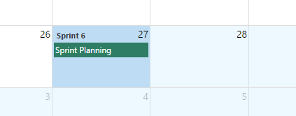
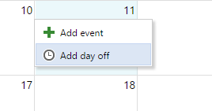
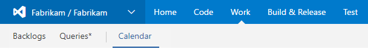

Team Calendar helps busy teams stay on track and informed about important deadlines, sprint schedules, and upcoming milestones. Team Calendar is the one place to see and manage the date important to your teams, including sprint schedule, days off (for individuals or the team), and custom events.

## Quick view of your sprint schedule

At a glance see when sprints start and end. No more guessing at how much time you have before the sprint ends.

Learn how to [setup your sprint schedule](https://msdn.microsoft.com/Library/vs/alm/work/scrum/define-sprints)

## Easily manage days off 

From your team calendar, mark days you (or anyone on your team) will be out of the office. Simply click a day and choose to add a day off. No more digging around the capacity settings page to set or manage days off.

Learn more about [capacity planning](https://msdn.microsoft.com/en-us/Library/vs/alm/Work/scale/capacity-planning)

## Plan better

Visualize the availability of the team as you plan your team. Understand who is unavailable and when. Know ahead of time when you have multiple team members out at the same time.

## Quick steps to get started

Team Calendar automatically shows iterations, days off, and configured working days for your team (see links below for help with setting these things up). 

1. Navigate to your project home and open the **Calendar** hub

   

2. You will see any iterations that occur in the month and also any days off already set for users or the team

### Add a custom event

1. Click a day and select **Add an event**

   

2. Provide a description, optionally choose a different end date and category

   

## Known issues

1. Auth-related HTTP errors when running Team Calendar on TFS 2015 Update 2. Upgrade to 2015 2.1.
2. Changing a user's profile image (avatar) is not reflected in the calendar due to 12 hour image caching. Check back after 12 hours.

## Learn more

The [source](https://github.com/microsoft/vso-team-calendar) for this extension is on GitHub. Take, fork, and extend. 
