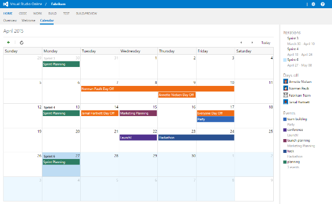
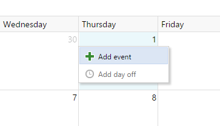
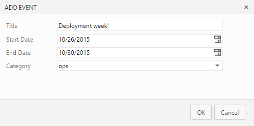
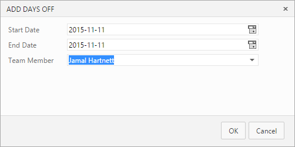

## Stay on track

Team Calendar is an extension for Visual Studio Online that helps busy teams stay on track and informed about important deadines, sprint schedules, and upcoming milestones. Team Calendar is the one place to see and manage the date important to your teams, including:

* Iterations 
* Days off (for individuals or the team)
* Custom events (single or multi-day)

## How to use

Team Calendar automatically shows iterations, days off, and configured working days for your team (see links below for help with setting these things up). 

1. Install the Team Calendar extension into your account

2. Navigate to your project home and open the **Calendar** hub

3. You should see your current sprint highlighted:
   

### Add a custom event

1. Click a day and select **Add an event**

   

2. Provide a description, optionally choose a different end date and category

   

  * Days off (for a user or team) can be added by left-clicking on a day

### Add a day off

1. Click a day **within an iteration** and select **Add day off**

   

2. Optionally change the end date and select either **Everyone** (meaning the entire team is off) or an individual user:

   

## Useful links

* [Define your sprints](https://msdn.microsoft.com/Library/vs/alm/work/scrum/define-sprints)
* [Configure days off](https://msdn.microsoft.com/en-us/Library/vs/alm/Work/scale/capacity-planning)

## Learn more about this extension

The source to this extension is available on GitHub: [Microsoft/vso-team-calendar](https://github.com/microsoft/vso-team-calendar). Feel free to take and modify. You can also contribute new event sources to this extension.

To learn more about developing an extension for Visual Studio Online, see the [overview of extensions](https://www.visualstudio.com/en-us/integrate/extensions/overview).