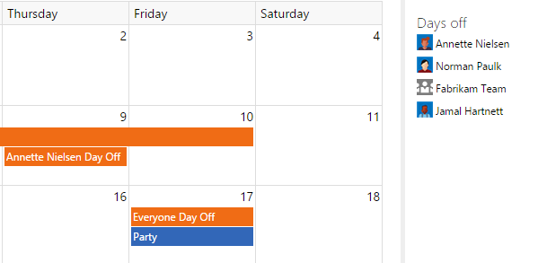

Team Calendar helps busy teams stay on track and informed about important deadines, sprint schedules, and upcoming milestones. Team Calendar is the one place to see and manage the date important to your teams, including sprint schedule, days off (for individuals or the team), and custom events.

## Quick view of your sprint schedule

At a glance see when sprints start and end. No more guessing at how much time you have before the sprint ends.

[Learn how](https://msdn.microsoft.com/Library/vs/alm/work/scrum/define-sprints) to define your sprint schedule

## Easily manage days off 

From your team calendar, mark days you (or anyone on your team) will be out of the office. Simply click a day and choose to add a day off. No more digging around the capacity settings page to set or manage days off.

## Plan better

Visualize the availability of the team as you plan your team. Understand who is unavailable and when. Know ahead of time when you have multiple team members out at the same time.

## Quick steps to get started

Team Calendar automatically shows iterations, days off, and configured working days for your team (see links below for help with setting these things up). 

1. Navigate to your project home and open the **Calendar** hub

### Add a custom event

1. Click a day and select **Add an event**

   

2. Provide a description, optionally choose a different end date and category

   

  * Days off (for a user or team) can be added by left-clicking on a day

## Useful links

* [Configure days off](https://msdn.microsoft.com/en-us/Library/vs/alm/Work/scale/capacity-planning)

## Learn more about this extension

The source to this extension is available on GitHub: [Microsoft/vso-team-calendar](https://github.com/microsoft/vso-team-calendar). Feel free to take and modify. You can also contribute new event sources to this extension.

To learn more about developing an extension for Visual Studio Online, see the [overview of extensions](https://www.visualstudio.com/en-us/integrate/extensions/overview).